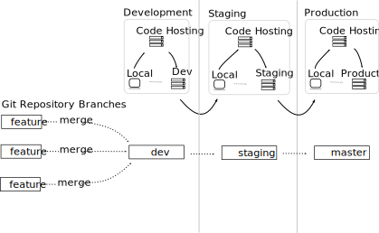
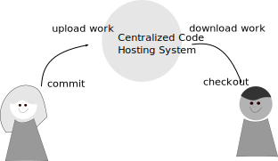
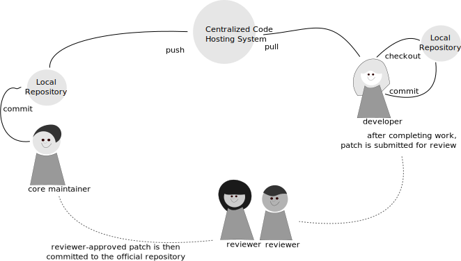
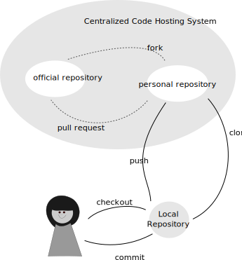
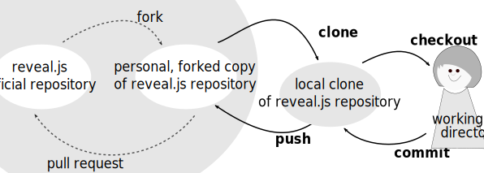
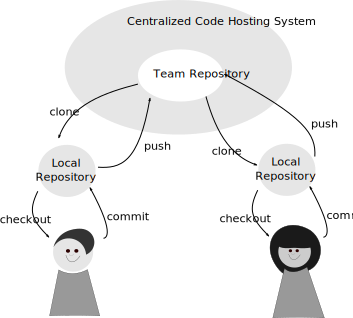

# Demystifying Setup for Git Teams

Emma Jane Hogbin Westby

@emmajanehw

www.gitforteams.com


----
# Agenda

- The Good; The Bad; The Ugly
- Repository architecture -- files to include, and omit
- Branching patterns -- what they are, and how to choose one
- Maintenance strategies -- how to keep your local repository up-to-date
- Access control -- ensuring the right people have the write access


## The Good

Git truths you need to internalise:

- Git is a very good content tracker for text files.
- Git is very fast compared to centralized VCS.


## The Bad

Git core will not solve all of your problems:

- Git is not a dependency manager.
- Git takes whole file snapshots.
- Git is not optimised for tracking binary files.
- Git does not include in-repository access control.
- Git becomes slower as your history gets very, very large.

Note: This means versioning binary files and having very long histories (10k+ commits) will cause Git to become slow.


## The Ugly

Git is notorious for its "holy wars".

This makes it seem very complicated and hard to learn.

This presentation unpacks the rationale behind the most common arguments.


----
# Repository Architecture

Important questions:

- How do you manage dependencies?
- Where do you store very large files?
- How do optimise your build process for very fast deployments?


## Dependency Management

- "Vendor branches" -- named branches for upstream work
- Version your build manifest
- Subtrees -- nest repositories without tracking
- Submodules -- nested repositories with hierarchical tracking


## Microservices or Monolith

Monolith:

- Consider your audience: if you don't need to scale, and it's easier for your team, use a single repository to store all knowledge for a project.
- If you don't know *exactly* what you're building, stick to one repo for your code.
- If the language you're working in doesn't have a package manager, consider using one repo for deployments.

Microservices:

- Think OOP: For separate functionality, use separate repositories.
- Pull together related pieces at build time.


## Very Large Files

- Compiled dependencies: i.e., libraries your program needs to run
- Asset binaries: e.g., source files for images, video files

Note: Is your repository a history of work over time (include versions of visual assets and other binaries); or something you use to deploy a project (do not include source assets)?


## Use Offsite Storage for Very Large Files

Do not version binaries in the repository; reference them from another location.

- [git-annex](https://git-annex.branchable.com/)
- [git-bigfiles](http://caca.zoy.org/wiki/git-bigfiles)
- [GLFS](https://git-lfs.github.com)

Note: Best Practice. http://blogs.atlassian.com/2014/05/handle-big-repositories-git/


## Use Shallow Clones for Faster Deployments

Avoid grabbing all versions of a file for the deployment.

````
$ git clone --depth [depth] [remote-url]
````

````
$ git clone [URL] --branch [branch_name] --single-branch [folder]
````


----
# Branching Patterns

Important questions:

- How do you separate your work in progress from fully tested, approved work?


## Popular Branching Conventions

- Scheduled Release (GitFlow)
- Branch-Per-Feature (GitHub Flow)
- State / Environment Branching (GitLab Flow)


## Scheduled Release


## Branch-Per-Feature


## State Branching




## Choose and Use a Strategy

- Pick a branching strategy which suits your deployment schedule.
- It doesn't _really_ matter which strategy you use.
- Document the exact steps people should use. Ensure documentation is followed.

Note: Best Practice.


----
# Maintenance Strategies

Important questions:

- How do you incorporate upstream work? aka How do you bring branches up to date?
- How do you combine newly approved work into your project's stable branch?


## Why the Fuss?<br/>Because TIMTOWTDI

- `pull` => `fetch` + `merge`
- `pull --rebase=preserve` => `fetch` + `rebase`
- `merge --no-ff` => forces a merge commit object (“true merge”)
- `merge --ff-only` => fast forward (graph looks like rebase)
- `merge --squash` => compress commits to one; then merge
- `rebase` => forward-port local commits
- `cherry-pick` => merge individual commits

Note: Pull request is fetch + merge with no fast forwards. Creates a merge commit. Often completed on a remote system with a one-click button. Forcing you into whatever workflow the UI has created for you. No flexibility! Merge request => setup the incoming work as a remote; review it locally; and then merge in the branch (or rebase!) however you would like. More steps to setup, but more control over how the work looks in the history graph.


### 

Note: Decisions, Decisions.


## Merging to Update is "Messy"


## Merge Commits to Combine are "Messy"


## Commit to Whole Thoughts

Reshape commit objects so that they are:

- just the right size
- contain only related code
- conforming to coding standards

````
$ git rebase --interactive HEAD~n
````

Resources: [gitforteams.com/resources/commit-granularity.html](http://gitforteams.com/resources/commit-granularity.html)

Note: Reshape your personal work history to reflect a whole idea before sharing it with others. This essentially mimics the creation of a patch. Rebasing also allows you to tease apart multiple ideas from a single commit and separate them into two different commits.


## Convert Conversations to Conclusions

- If the review process has resulted in additional commits, squash these commits into logical conclusions.

Prior to merge:
````
$ git rebase --interactive HEAD~n
````

At merge:
````
$ git merge --squash NNNN-pull_request_branch
````

Note: Make patches from pull requests. With a Web-based interface, we’re now seeing a lot more conversations happen alongside the code, with tiny commits and adjustments along the way. Previously this conversation might have happened in a mailing list, with patches attached. Same conversation, but the patches reflected whole “conclusions” up to that point. There were no micro commits in the repository history. In other words, when we moved to a web-based system with conversations, we essentially switched from conclusion-based commits to conversation artefacts.


----
# Access Control

Important questions:

- Who gets write access?
- What can they commit to?


## Per-Branch Permissions & Restrictions

- aka The Subversion Way
- now available from GitLab, and Bitbucket


## Pull Request Model

- aka The GitHub Way
- available everywhere


### Centralised Systems



### Basic Setup with Central Repo


### "Ancient" Patching Workflow



### Forking Workflow -- Pull Requests



### Forking Workflow -- Example



### All Access Workflow 



----
# Summary

- Repository architecture -- include only what you can't build 
- Branching patterns -- what they are, and how to choose one
- Maintenance strategies -- how to keep your local repository up-to-date
- Access control -- ensuring the right people have the write access


Best Practices
## Repository Architecture

- Store very large files outside of the repository.
- Speed up deployments with shallow clones.
- Use a single repository when individual services aren't known.
- Create stand-alone repositories when you can identify discrete operations.


Best Practices
## Branching Patterns

- Choose and use a strategy that suits your deployment model.
- e.g. GitFlow, GitHub Flow, GitLab Flow
- aka Scheduled Deployments, Branch-per-Feature, Environment/State Branching


Best Pratices
## Maintenance Strategies

- When submitting work for review: Commit to whole thoughts.
- When merging work: Convert conversations to conclusions.


Best Practices
## Access Control

- Choose and use a strategy that suits your governance model.
- Per-repository access with pull requests is typical; per-branch is becoming more common.
- e.g. Patching, Forking, All Access.


## gitforteams.com

Emma Jane Hogbin Westby

@emmajanehw

[emmajane.github.io/team-setup-overview](http://emmajane.github.io/team-setup-overview)

[](http://shop.oreilly.com/product/0636920034520.do?cmp=af-prog-books-videos-product_cj_auwidget670_0636920034520_4470479)
[](http://shop.oreilly.com/product/0636920034872.do?cmp=af-prog-books-videos-product_cj_auwidget671_0636920034872_4470479)


-----------
# Resources
<!-- .slide: data-background="#fff9f9" -->


## Big Repositories
<!-- .slide: data-background="#fff9f9" -->

- [How to Handle Big Repositories with Git](https://www.atlassian.com/git/articles/how-to-handle-big-repositories-with-git/)
- [HackerNews: How do you handle your microservices](https://news.ycombinator.com/item?id=9705098)
- [StackExchange: How do you handle external dependencies?](http://programmers.stackexchange.com/questions/110093/how-would-one-handle-external-dependencies-in-an-open-source-project)
- [Organizing Microservices in a Single Repository](http://blog.plataformatec.com.br/2015/01/organizing-microservices-in-a-single-git-repository/)


## Dependency Management
<!-- .slide: data-background="#fff9f9" -->

- [Paket for .NET and Mono](http://fsprojects.github.io/Paket/)
- [Composer for PHP](https://getcomposer.org/doc/00-intro.md)


## Submodules
<!-- .slide: data-background="#fff9f9" -->

- [Mastering Submodules](https://medium.com/@porteneuve/mastering-git-submodules-34c65e940407)
