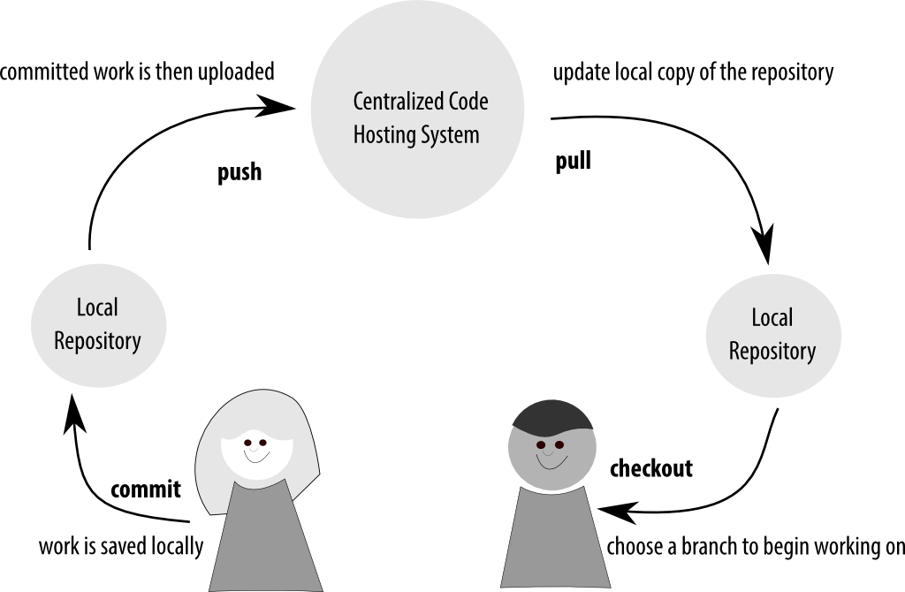
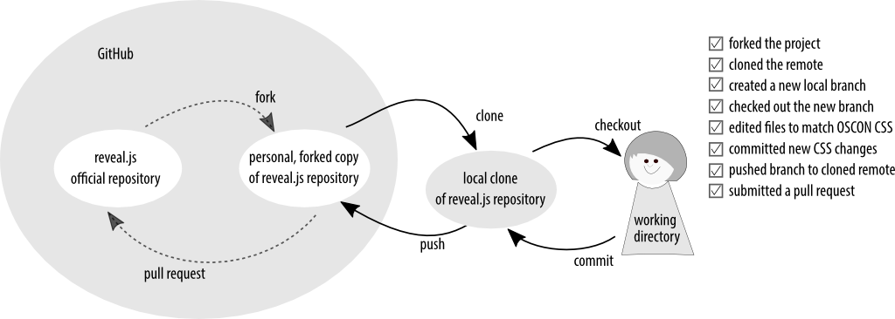
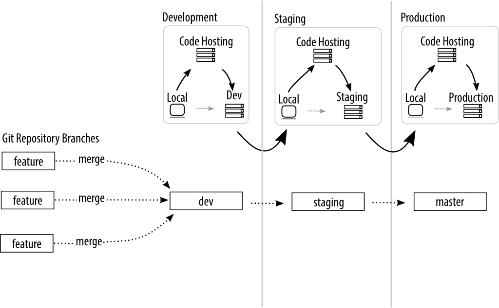
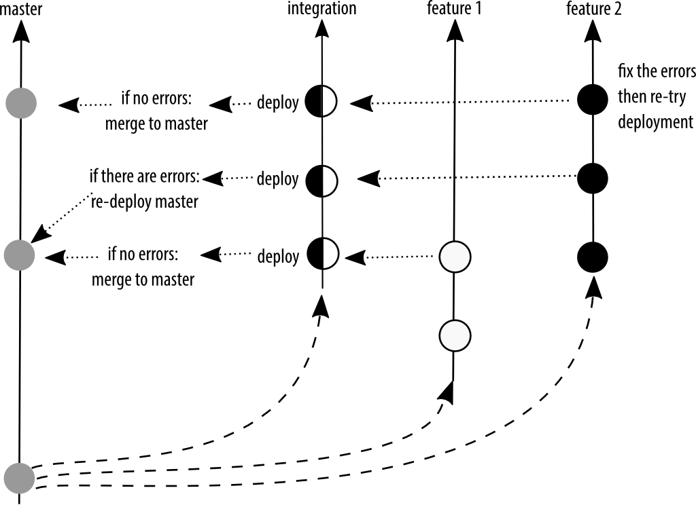
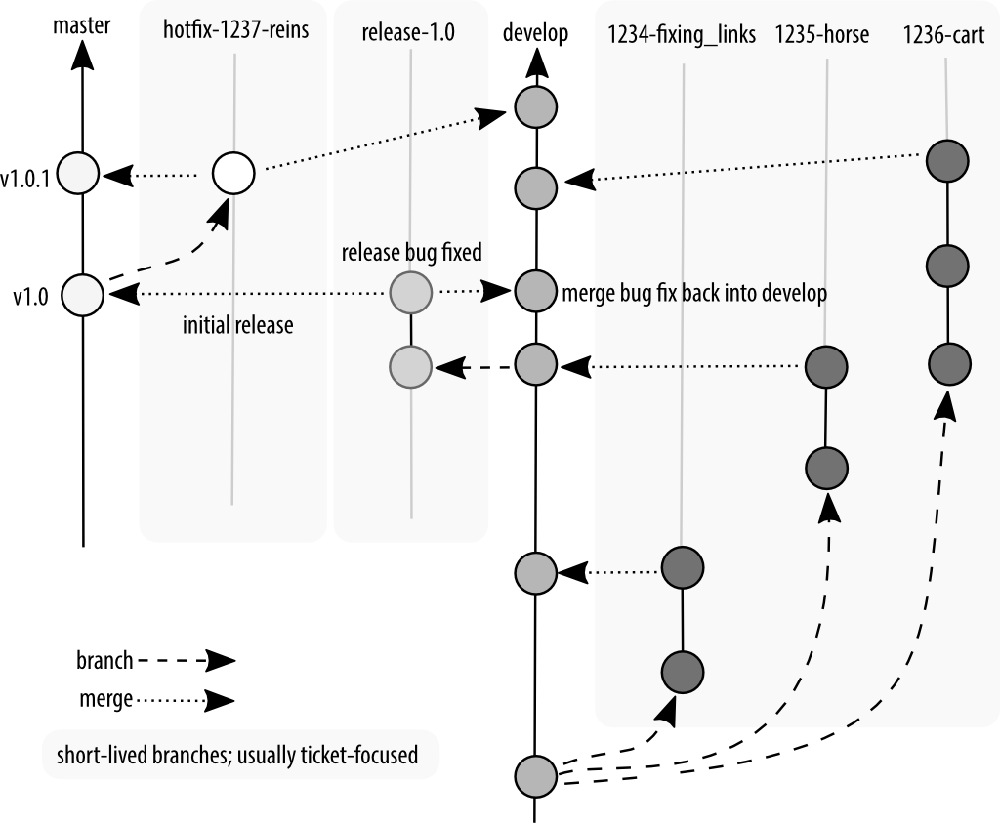

# Git's Golden Rules (for Teams) 

Emma Jane Hogbin Westby

@emmajanehw

www.gitforteams.com


----
# Who Thinks Git is <br />Weird and Hard?


# Git is Easy?


# Only Gits Raise Their Hand When Asked?


# Git is Good...


# Git is a great<br />**content tracker** for **text files**.


## Git is very fast<br/>compared to centralised<br/>version control systems.


# Git is not magic.


# Git is not a dependency manager.


# Git does not have access control.


# Git stores <br />whole file snapshots.


# Git is not optimised for binary files.


# Git becomes slower as your history gets very, very large.

Note: This means versioning binary files and having very long histories (10k+ commits) will cause Git to become slow.


# (where "very large" means 10,000+ commits)


# Git Can Get Ugly...

Note: Git is notorious for its "holy wars". This makes it seem very complicated and hard to learn. This presentation unpacks the rationale behind the most common arguments.


# It's not really your fault though.


## Git is weird and hard because <br/>the internals have strong opinions, <br />but the interface does not.


----
# Warning:
## contains opinions


----
# Git's Golden Rules

1. Talk to your teammates.
2. Separate your ideas.
3. Be consistent.
4. Include only what you need.


----
Golden Rule #1
# Talk to your teammates.


## Map access, then map commands.


### Basic Setup



### Pull Requests



## Golden Rule
# Talk to your teammates.
Map access, then map commands. Use **branch locking** or **forks** to control access.


----
Golden Rule #2:
# Separate your ideas.

Note: How do you separate: work in progress and fully tested, approved work?


# Document and Use a Single Branching Strategy


## Popular Branching Conventions

- State / Environment Branching (GitLab Flow)
- Branch-Per-Feature (GitHub Flow)
- Scheduled Release (GitFlow)


## State Branching




## Branch-Per-Feature




## Scheduled Release




## One ball per idea.


## Commit to Whole Ideas<br/>Prior to Merge

````
$ git rebase --interactive HEAD~n
````


## Convert Conversations to Conclusions at Merge

````
$ git merge --squash NNNN-pull_request_branch
````

Note: If the review process has resulted in additional commits, squash these commits into logical conclusions. Make patches from pull requests. With a Web-based interface, we’re now seeing a lot more conversations happen alongside the code, with tiny commits and adjustments along the way. Previously this conversation might have happened in a mailing list, with patches attached. Same conversation, but the patches reflected whole “conclusions” up to that point. There were no micro commits in the repository history. In other words, when we moved to a web-based system with conversations, we essentially switched from conclusion-based commits to conversation artefacts.


## Golden Rule
# Separate your ideas.
Every commit and each branch should hold a coherent unit of work.


----
Golden Rule #3:
# Be consistent.

Note: How do you incorporate upstream work? aka How do you bring branches up to date? How do you combine newly approved work into your project's stable branch?


# Document and use a maintenance strategy.


## Why the Fuss?<br/>Because TIMTOWTDI

- `pull` => `fetch` + `merge`
- `pull --rebase=preserve` => `fetch` + `rebase`
- `merge --no-ff` => forces a merge commit object (“true merge”)
- `merge --ff-only` => fast forward (graph looks like rebase)
- `merge --squash` => compress commits to one; then merge
- `rebase` => forward-port local commits
- `cherry-pick` => merge individual commits

Note: Pull request is fetch + merge with no fast forwards. Creates a merge commit. Often completed on a remote system with a one-click button. Forcing you into whatever Work Flow the UI has created for you. No flexibility! Merge request => setup the incoming work as a remote; review it locally; and then merge in the branch (or rebase!) however you would like. More steps to setup, but more control over how the work looks in the history graph.


(if you care)
## Update with Rebase 

````
$ git pull --rebase=preserve
````


## Golden Rule
# Be consistent.
Keep your history legible<br/>by having the team use a single strategy to update branches.


----
Golden Rule #4
# Include only what you need.

Note: How do you manage dependencies? Where do you store very large files? How do optimise your build process for very fast deployments?


## Outsource your dependency management

Note: Version only your build manifest


## If you must include external work

- Keep your "core" clean and track upstream work with named branches.
- Nest repositories without tracking by using subtrees (clone inside a clone).
- Git can track external repositories with submodules. There be dragons.


## Store as much as you need, <br />but not more.


# Monolith:
## one mega repo

Note: Consider your audience: if you don't need to scale, and it's easier for your team, use a single repository to store all knowledge for a project. If you don't know *exactly* what you're building, stick to one repo for your code. If the language you're working in doesn't have a package manager, consider using one repo for deployments.


# Microservices:
## many ickle repos

Note: Think OOP: For separate functionality, use separate repositories. Pull together related pieces at build time.


# Binary files will grow with each version

Note: Deployment binaries vs. project assets.


## Use off-site storage for very large files

Do not version binaries in the repository; reference them from another location.

- [git-annex](https://git-annex.branchable.com/)
- [git-bigfiles](http://caca.zoy.org/wiki/git-bigfiles)
- [GLFS](https://git-lfs.github.com)

Note: Best Practice. http://blogs.atlassian.com/2014/05/handle-big-repositories-git/


## Use shallow clones for faster deployments

Avoid grabbing all versions of a file for the deployment.

````
$ git clone --depth [depth] [remote-url]
````

````
$ git clone [URL] --branch [branch_name] --single-branch [folder]
````


## Golden Rule
# Include only what you need.

Outsource your dependency management. Break your repository into smaller service repositories when it's time. Binary files grow when versioned. Use shallow clones for faster deployments.


----
# The Golden Rules

- Talk to your teammates: access control.
- Separate your ideas: branching patterns.
- Be consistent: maintenance strategies.
- Include only what you need: repository architecture.


Best Practices
## Access Control

- Choose and use a strategy that suits your governance model.
- Basic setup has teammates share a centralised repository.
- Pull requests are commonly used as an access gate (for specific branches).


Best Practices
## Branching Patterns

Choose and use a strategy that suits your deployment model.

- GitFlow -- Scheduled Deployments
- GitHub Flow -- Branch-per-Feature
- GitLab Flow -- Environment/State Branching
- When submitting work for review: Commit to whole thoughts.
- When merging work: Convert conversations to conclusions.


Best Practices
## Maintenance Strategies

- By default `pull` will `merge`. This is hard to read in a graph.
- (if it matters): use `pull --rebase=preserve` to update your branches.


Best Practices
## Repository Architecture

- Store very large files outside of the repository.
- Speed up deployments with shallow clones.
- Start with a single repository while you finalise your architecture.
- Refactor into stand-alone repositories when you can identify discrete services.


## gitforteams.com

Emma Jane Hogbin Westby

@emmajanehw

[emmajane.github.io/git-team-setup-overview](http://emmajane.github.io/git-team-setup-overview)

[](http://shop.oreilly.com/product/0636920034520.do?cmp=af-prog-books-videos-product_cj_auwidget670_0636920034520_4470479)
[](http://shop.oreilly.com/product/0636920034872.do?cmp=af-prog-books-videos-product_cj_auwidget671_0636920034872_4470479)


-----------
# Resources
<!-- .slide: data-background="#fff9f9" -->


## Big Repositories
<!-- .slide: data-background="#fff9f9" -->

- [How to Handle Big Repositories with Git](https://www.atlassian.com/git/articles/how-to-handle-big-repositories-with-git/)
- [HackerNews: How do you handle your microservices](https://news.ycombinator.com/item?id=9705098)
- [StackExchange: How do you handle external dependencies?](http://programmers.stackexchange.com/questions/110093/how-would-one-handle-external-dependencies-in-an-open-source-project)
- [Organizing Microservices in a Single Repository](http://blog.plataformatec.com.br/2015/01/organizing-microservices-in-a-single-git-repository/)


## Dependency Management
<!-- .slide: data-background="#fff9f9" -->

- [Paket for .NET and Mono](http://fsprojects.github.io/Paket/)
- [Composer for PHP](https://getcomposer.org/doc/00-intro.md)


## Submodules
<!-- .slide: data-background="#fff9f9" -->

- [Mastering Submodules](https://medium.com/@porteneuve/mastering-git-submodules-34c65e940407)
